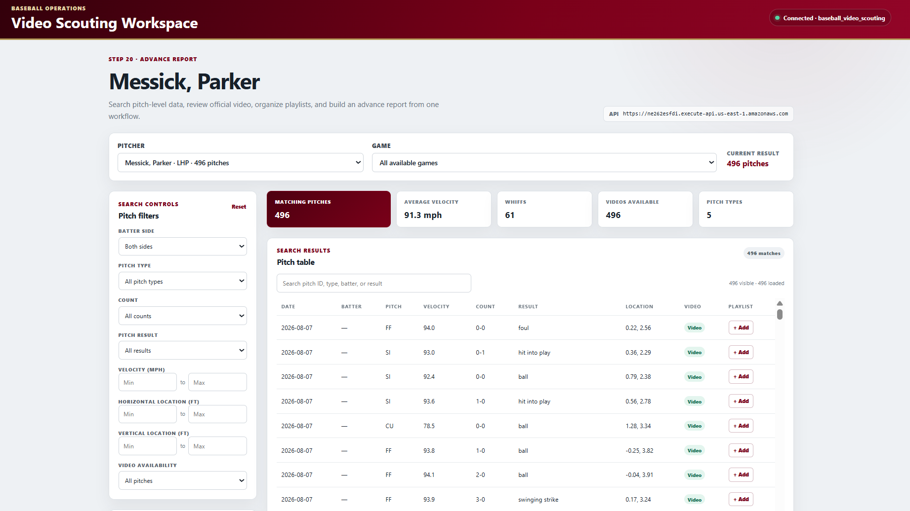
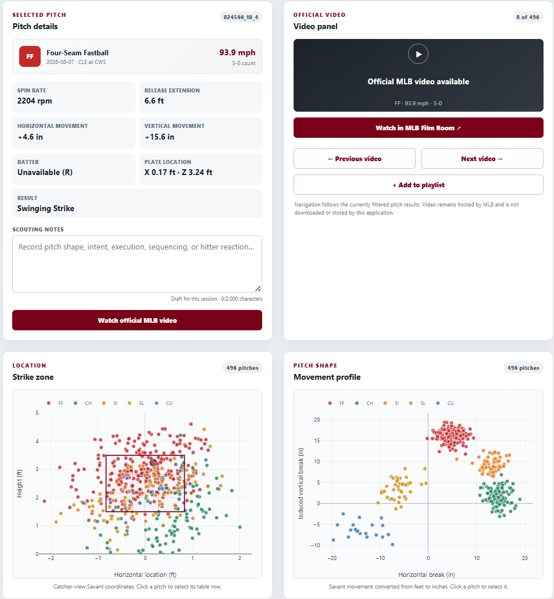
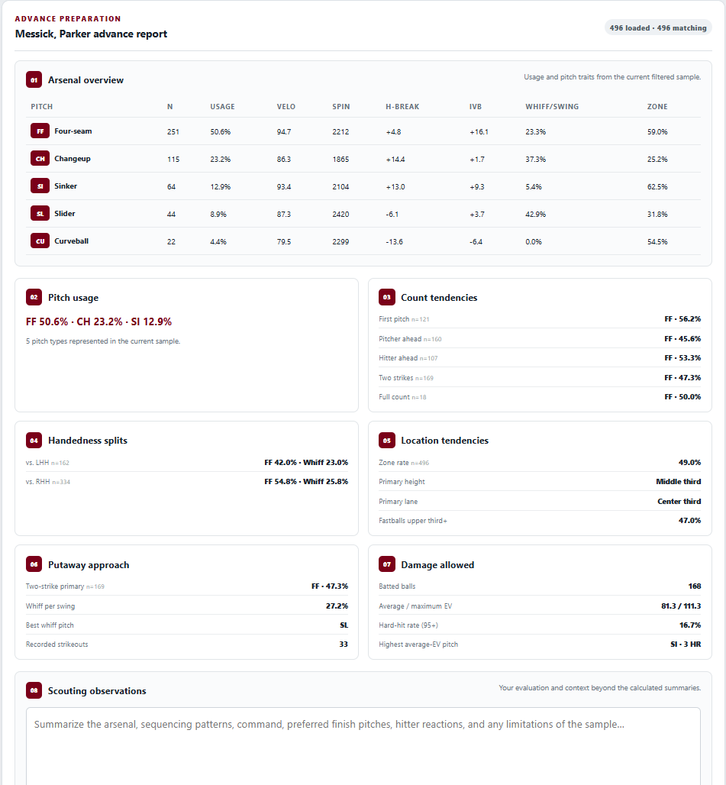
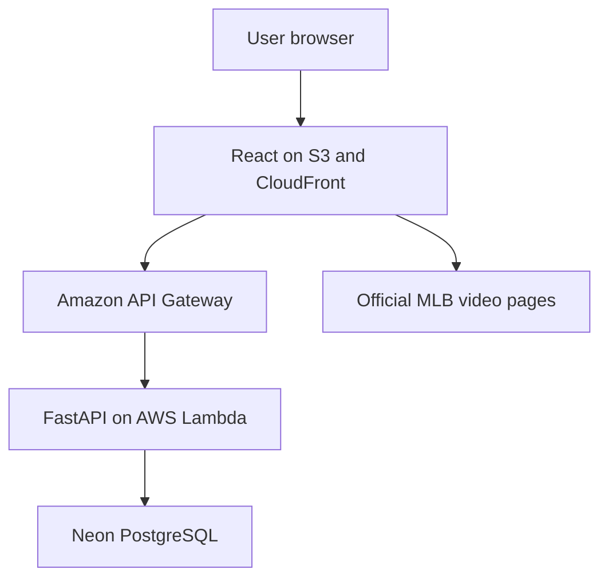

# Baseball Video Scouting Workspace

[Open the live application](https://dctxxfgaduzx1.cloudfront.net) · [View the FastAPI documentation](https://ne262esfdi.execute-api.us-east-1.amazonaws.com/docs)

A full-stack baseball operations portfolio project that connects pitch-level Baseball Savant data, official MLB video links, PostgreSQL, a FastAPI REST API, and an interactive React scouting interface.

The application supports pitch searching, visual analysis, official video review, ordered playlists, scouting notes, and an advance report. It is a public workflow inspired by systems used in professional baseball, but it is not BATS, TruMedia, or Synergy experience.

## Live portfolio version

The deployed version uses an intentionally curated sample of Parker Messick's five outings from August 7 through August 30, 2026. The sample contains 496 pitches across five games, allowing the pitch-level data and video associations to be checked carefully while keeping the project focused on workflow design rather than dataset size.

The public application operates in read-only mode. Visitors can filter pitches, inspect charts, add pitches to an in-browser review queue, reorder them, write temporary scouting notes, and open official video links. Permanent playlist database writes remain available only in the local development version.

The application stores links to official MLB video pages. It does not download, host, embed, or redistribute MLB video files.

## Current capabilities

- Repeatable one-command ingestion from a manual Savant CSV export
- Reproducible optional video joins using stable pitch IDs
- Relational PostgreSQL storage for players, games, pitches, videos, and playlists
- Validated FastAPI endpoints for pitch filters, summaries, videos, and playlist operations
- React and TypeScript scouting workspace with Plotly charts
- Pitch-detail and official-video navigation controls
- Persistent ordered playlists with per-pitch notes in local development
- Read-only public portfolio mode with an in-browser review queue
- Managed production deployment through AWS and Neon PostgreSQL
- Advance-report view covering arsenal, count and handedness tendencies, location, putaway approach, and damage allowed
- Automated Python and React tests for data logic, API behavior, SQL, playlists, video navigation, and report calculations
- Dockerized FastAPI, React/Nginx, PostgreSQL 18, and automatic data-loading services

## Application preview

### Pitch-search workspace



### Pitch details, video and visual analysis



### Advance scouting report



## Architecture



The Python ETL pipeline transforms permitted Baseball Savant exports, creates stable pitch IDs, derives scouting features, joins verified video links, and loads relational records into PostgreSQL. The production API retrieves its pooled database connection securely through AWS Secrets Manager.

React sends requests through API Gateway to FastAPI running in a Lambda container. FastAPI queries Neon PostgreSQL and returns JSON to the interface. Video requests open official MLB pages directly in the visitor's browser; MLB video is never stored in PostgreSQL, S3, Lambda, or this repository.

## Technology

- Python, pandas, and psycopg
- PostgreSQL and explicit parameterized SQL
- FastAPI and Pydantic
- React, TypeScript, Vite, and Plotly
- pytest, Vitest, React Testing Library, and coverage reporting
- Docker, Docker Compose, and Nginx
- AWS SAM, ECR, Lambda Web Adapter, API Gateway, and CloudWatch
- Amazon S3, CloudFront, IAM, and Secrets Manager
- Neon managed PostgreSQL
- GitHub Actions continuous integration

## Repository layout

```text
baseball-video-scouting/
├── backend/
│   ├── app/
│   │   ├── models/
│   │   ├── routers/
│   │   ├── schemas/
│   │   └── services/
│   ├── tests/
│   ├── .env.example
│   ├── Dockerfile
│   └── requirements.txt
├── database/
│   └── schema.sql
├── frontend/
│   ├── src/
│   │   ├── components/
│   │   ├── pages/
│   │   ├── services/
│   │   └── types/
│   ├── package.json
│   ├── package-lock.json
│   ├── Dockerfile
│   └── nginx.conf
├── data/
│   ├── raw/
│   ├── processed/
│   └── sample/
├── scripts/
│   ├── clean_statcast.py
│   ├── ingest_savant.py
│   ├── load_database.py
│   └── requirements.txt
├── docs/
│   └── docker.md
├── docker-compose.yml
├── .dockerignore
├── .env.docker.example
└── .github/workflows/
```

## Docker quick start

Docker is the simplest way to start the complete application on another computer. After installing and opening Docker Desktop, copy the Docker environment template:

```powershell
Copy-Item .env.docker.example .env.docker
code .env.docker
```

Replace `replace_with_a_local_docker_password`, make sure `data\processed\Messick_cleaned.csv` exists, and start the entire stack:

```powershell
docker compose --env-file .env.docker up --build
```

Then open:

- Application: [http://127.0.0.1:5173](http://127.0.0.1:5173)
- FastAPI documentation: [http://127.0.0.1:8000/docs](http://127.0.0.1:8000/docs)
- Health check: [http://127.0.0.1:8000/health](http://127.0.0.1:8000/health)

See [`docs/docker.md`](docs/docker.md) for the complete Windows setup, service architecture, troubleshooting, logs, stopping, and database-reset instructions.

## Local setup

Run commands from the repository root unless a step says otherwise.

### 1. Create and activate the Python environment

PowerShell:

```powershell
python -m venv .venv
Set-ExecutionPolicy -Scope Process -ExecutionPolicy RemoteSigned
.\.venv\Scripts\Activate.ps1
python -m pip install --upgrade pip
python -m pip install -r backend\requirements.txt -r scripts\requirements.txt
```

### 2. Create the PostgreSQL schema

Create a database named `baseball_video_scouting`, then run:

```powershell
psql -U postgres -d baseball_video_scouting -f database\schema.sql
```

If `psql` is not on your PATH, call the executable from your PostgreSQL `bin` folder.

### 3. Configure the API

```powershell
Copy-Item backend\.env.example backend\.env
```

Open `backend\.env`, enter the local database password, and never commit that file.

### 4. Prepare the data

Place your permitted Savant CSV and video-link spreadsheet in `data\raw`, then run:

```powershell
python scripts\clean_statcast.py `
  --savant-csv data\raw\Messick_Data_with_ids.csv `
  --video-table data\raw\Messick_video_links.xlsx `
  --output data\processed\Messick_cleaned.csv `
  --require-all-video
```

The video join is performed by `pitch_id`, never by spreadsheet row position.

### 5. Load PostgreSQL

```powershell
python scripts\load_database.py --csv data\processed\Messick_cleaned.csv
```

The loader prompts for the PostgreSQL password if `PGPASSWORD` is not set. It is idempotent: matching primary keys are updated instead of duplicated.

For season-wide monthly exports, use the combined dry-run and ingestion command
documented in [`docs/ingestion.md`](docs/ingestion.md). It cleans, validates,
checks the expected season, and atomically upserts one manual Savant export.

### 6. Start FastAPI

```powershell
python -m uvicorn app.main:app --reload --app-dir backend
```

Confirm [http://127.0.0.1:8000/health](http://127.0.0.1:8000/health) returns `status: ok`. Interactive API documentation is at [http://127.0.0.1:8000/docs](http://127.0.0.1:8000/docs).

### 7. Start React

Open a second PowerShell terminal:

```powershell
cd frontend
npm install
npm run dev
```

Open the exact local URL shown by Vite. The default API URL is `http://127.0.0.1:8000`.

## Automated tests

The test suite is self-contained: it does not use your PostgreSQL password, modify your local database, or require the complete Messick dataset.

### Python tests

From the repository root with `.venv` activated:

```powershell
python -m pip install -r backend\requirements-dev.txt
python -m pytest
```

To include a terminal coverage report:

```powershell
python -m pytest --cov=backend/app --cov=scripts --cov-report=term-missing
```

The backend suite covers pitch-ID creation, cleaning and missing values, count and whiff classification, video joins, Pydantic validation, combined API filters, parameterized SQL, relational record mapping, duplicate detection, and playlist operations.

### React tests

```powershell
cd frontend
npm install
npm run test:run
```

To generate frontend coverage:

```powershell
npm run test:coverage
```

The frontend suite covers API query serialization and errors, playlist POST requests, pitch-table search and selection, add-to-playlist behavior, official-video navigation, and advance-report metrics.

## Data and credential policy

Do not commit:

- `.env` files, database passwords, access tokens, private keys, or credentials
- Full raw or cleaned datasets
- PostgreSQL dumps
- Downloaded MLB video or other copyrighted media
- `node_modules`, Python virtual environments, or generated build output

Only small, intentionally selected sample data should ever be placed in `data/sample`.

## Release status

Version 1.0 provides a complete, deployed scouting workflow built around a carefully reviewed five-game sample. The application is publicly accessible, while its database and cloud credentials remain protected.

Potential future development includes:

- Expanding to a multi-pitcher or full-season dataset
- Import-batch history and row-level ingestion errors
- Server-side pagination and database-generated chart summaries
- Additional verified official video links
- Authentication for private playlist persistence
- Custom domain configuration

## Project positioning

A precise resume description is: “Built a full-stack, video-linked baseball scouting workflow using Python, PostgreSQL, FastAPI, React, TypeScript, and Plotly.” Do not describe this project as direct experience with proprietary baseball systems.
